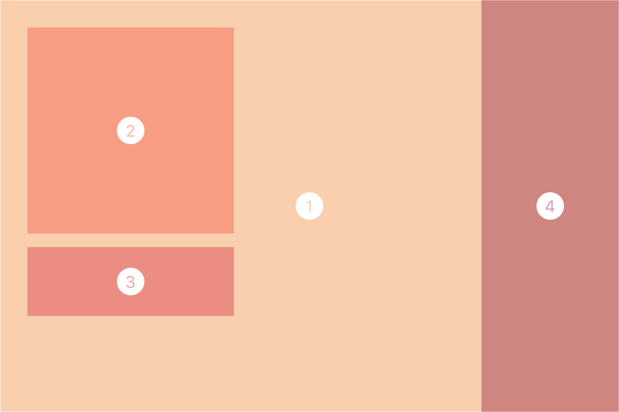
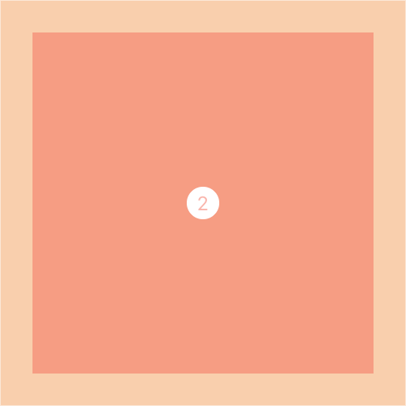
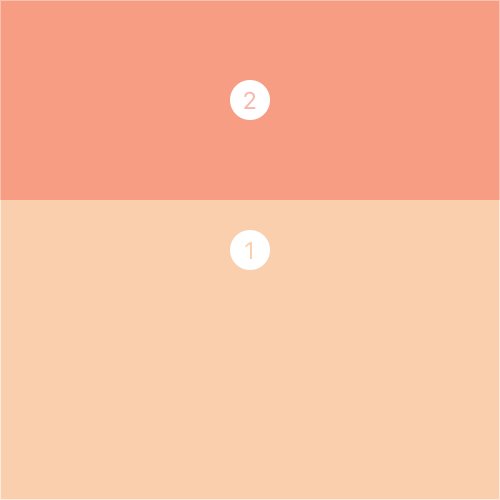
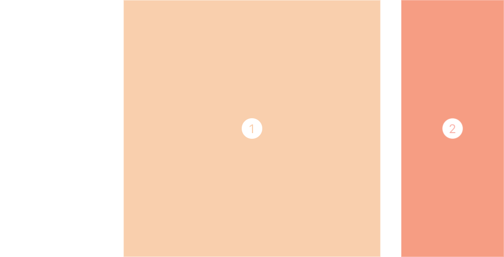
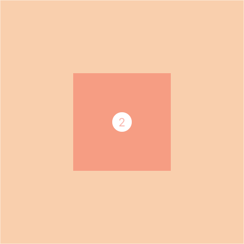
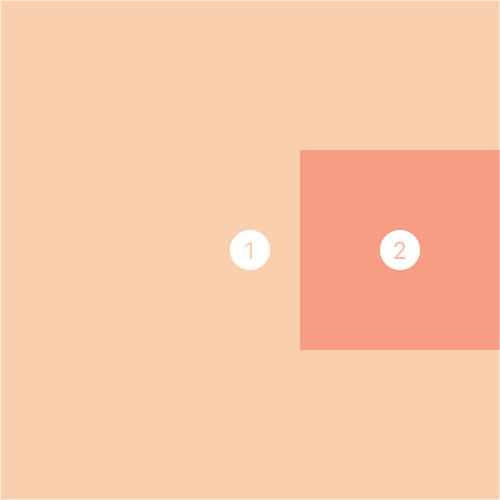
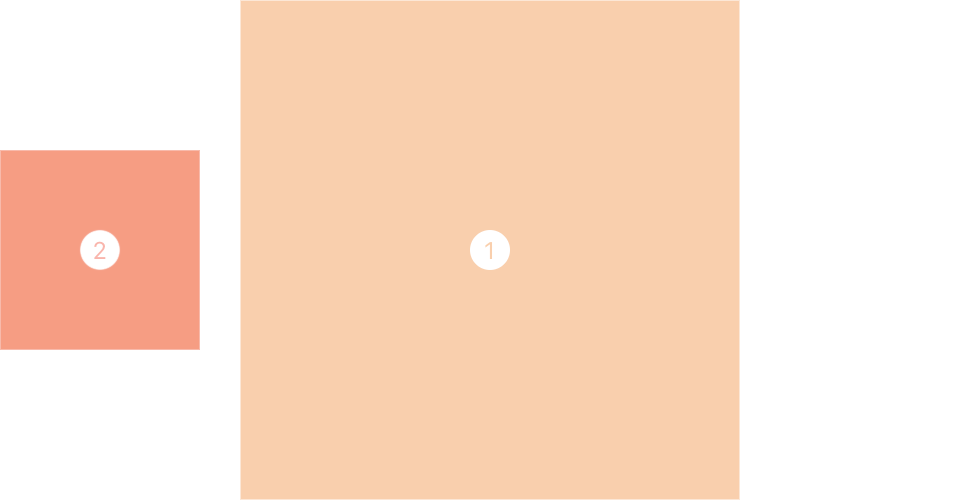
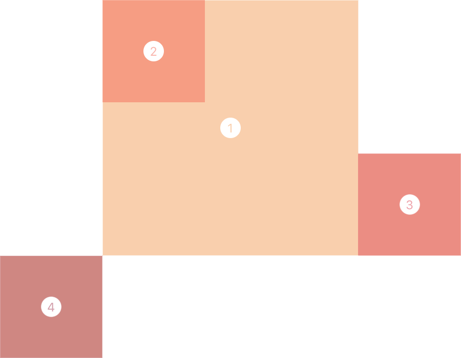
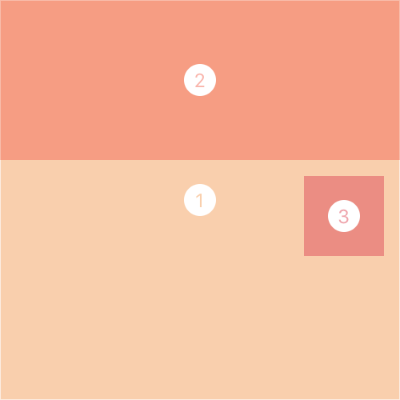

<p align="center">

<br />
A lightweight library for simple view layout in Swift.
<br /><br />
</p>

# 
<br />

<p align="center">

</p>

```swift
view1.layout.size(width: 450, height: 300)
view1.layout.center(in: self.view)

view2.layout.size(150)
view2.layout.corner(view1.top.inside + 20, view1.left.inside + 20)

view3.layout.height(50)
view3.layout.fill(view2.bottom.outside + 10)

view4.layout.width(100)
view4.layout.fill(view1.right.inside)
```

## Install with Carthage
To integrate LayoutKit into your Xcode project using [Carthage](https://github.com/Carthage/Carthage), specify it in your `Cartfile`:

```ogdl
github "avario/LayoutKit" ~> 1.2
```

Run `carthage update` to build the framework and drag the built `LayoutKit.framework` into your Xcode project.

## Creating Constraints
LayoutKit utilises a modified version of [SwiftAutoLayout](https://github.com/indragiek/SwiftAutoLayout) which allows `NSLayoutConstraint`s to be created like this:

```swift
let constraint = view1.left == view2.right * 2.0 + 10.0 ~ 750
```

> **Note:** Constraints can also be created against `UILayoutGuide` and `UILayoutSupport`.

## Layout Helpers
LayoutKit also provides a number of helper methods accessed through the `layout` proxy for common layout situations. Each one returns an array or tuple of the constraints it creates so they can be stored and modified.

Using the `layout` proxy automatically sets `translatesAutoresizingMaskIntoConstraints` to `false`, and will activate any constraints it creates.

### Apply
Apply multiple constraints to a view by using the `apply` method. This allows you to specify any custom constraint that `AutoLayout` is capable of.

```swift
view1.layout.apply(
    view1.height == 100,
    view1.width == view2.width,
    view1.top == view3.bottom + 10
)
```

### Size
Set the size of a view to constant values by using the `size` method.

```swift
view1.layout.size(width: 100, height: 200)
```

Make it square by specifying only one value.

```swift
view1.layout.size(150)
```

Or set the height and width individually by using the `height` and `width` methods.

```swift
view1.layout.width(100)
view1.layout.height(200)
```

### Fill
You can have one view fill another by using the `fill()` method. Optionally specify `UIEdgeInsets` to give the view some padding.

```swift
view2.layout.fill(view1, UIEdgeInsets(20))
```

<p align="center">

</p>

> **Note:** One view does not have to be a subview of the other in order to fill it. As with all constraints, the views must only share a common ancestor.

### Fill Edge
Have one view fill the edge of another (i.e., stretch along it) by using the `fill()` method specifying an edge. You can also specify `UIEdgeInsets` with this method to add padding.

```swift
view2.layout.height(100)
view2.layout.fill(view1.top.inside)
```

<p align="center">

</p>

You can also fill an edge on the outside, effectively placing one view beside another.
> **Note:** Many use cases of for this are better served by [`UIStackView`](https://developer.apple.com/reference/uikit/uistackview).

```swift
view2.layout.width(100)
view2.layout.fill(view1.right.outside + 20)
```

<p align="center">

</p>

### Center
Center a view inside another view by using the `center(in:)` method. You can also specify a `UIOffset` parameter to offset the view's center from the center it is being constrained to.

```swift
view2.layout.size(100)
view2.layout.center(in: view1)
```

<p align="center">

</p>

### Center On Edge
You can center a view on an edge by using the `center(on:)` method.

```swift
view2.layout.size(100)
view2.layout.center(on: view1.right.inside)
```

<p align="center">

</p>

You can also center on the outside of an edge.

```swift
view2.layout.size(100)
view2.layout.center(on: view1.left.outside - 20)
```

<p align="center">

</p>

### Corner
Layout a view in a corner by using the `corner()` method.

```swift
view2.layout.size(100)
view2.layout.corner(view1.top.inside, view1.left.inside)
    
view3.layout.size(100)
view3.layout.corner(view1.bottom.inside, view1.right.outside)
    
view4.layout.size(100)
view4.layout.corner(view1.bottom.outside, view1.left.outside)
```

<p align="center">

</p>

You can also layout in corners that are made by two different views.

```swift
view3.layout.size(50)
view3.layout.corner(view2.bottom.outside + 10, view1.right.inside - 10)
```

<p align="center">

</p>


## Updating Constraints
LayoutKit provides no additional functionality to update constraints. Simply store a reference to any constraint you want to modify and then change its `constant`.

```swift
let leftConstraint = view2.layout.fill(view1).leftConstraint

// Update to add padding on the left of the view
leftConstraint.constant = 20
```

> **Note:** You will need to call `layoutIfNeeded()` to see the effect of this change.

Storing a reference to the constraint may seem like a tiresome exercise, especially considering other libraries implement ways around this. However, it's important to realise that you're updating the constraint, not the view, and not a property of the view. This practice also enforces the creation of more considerate constraints, and more reactive and robust layouts.

### Animating Constraints
LayoutKit also provides no additional functionality to animate constraints. Simply update the constraint and then call `layoutIfNeeded()` on the owning view within an animation block.

```swift
constraint.constant = 100
UIView.animate(withDuration: 0.5) {
    view.layoutIfNeeded()
}
```

> **Note:** It's often a good idea to also call `layoutIfNeeded()` before the constraint is updated to ensure any existing constraints have been updated.

Animating constraints can often lead to complex code and unexpected results. Consider `layer` animations as an often more suitable alternative.

## Geometry Extensions
LayoutKit also provides extensions to several `CGGeometry` and `UIGeometry` structures to make layout easier.

### CGSize
Initialise a square `CGSize` by specifying only one value:
```swift
let size = CGSize(100)
```

### CGRect
Initialise a `CGRect` with `0,0` origin by specifying a size only:
```swift
let rect = CGRect(size: CGSize(width: 100, height: 200))
```

Or create a square `CGRect` by only specifying one value:
```swift
let rect = CGRect(100)
```

### UIOffset
Initialise a `UIOffset` with only a horizontal or vertical offset by only specifying one parameter:
```swift
let offset = UIOffset(vertical: 100)
```

### UIEdgeInsets
Initialise `UIEdgeInsets` by specifying insets for only some edges:
```swift
let insets = UIEdgeInsets(top: 100, left: 20)
```

You can also provide a default value for the edges you don't specify by using `others`:
```swift
let insets = UIEdgeInsets(top: 200, others: 50)
```

Create insets for only horizontal or vertical edges (or both):
```swift
let insets = UIEdgeInsets(horizontal: 20)
```

Create insets with all edges having the same value:
```swift
let insets = UIEdgeInsets(50)
```
